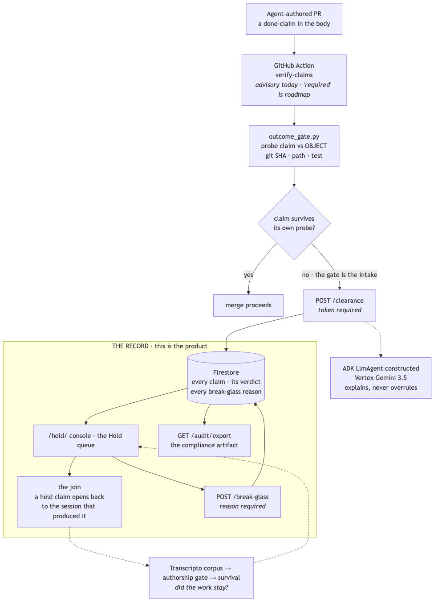

# THE AGENT WORK RECORD WITNESS

**Run your agents. Check the math.**

Software just changed hands. Most of the code written this year is written by agents, and the
constraint moved with it. Writing is cheap now, and **knowing what was actually done is the
expensive part.** Every company can tell you how many agent seats it bought and how many tokens
burned. Not one can tell you what those agents did, or how much of what they reported was true.

That gap has no artifact. No audit log, no flight recorder, no lab notebook. An agent finishes,
writes a paragraph about what it did, an auto-merge rule reads that paragraph, and it scrolls away
forever. It is a production surface nobody governs and nothing remembers.

**Within five years, "what fraction of our merged code carries a claim nobody checked?" is a
question a board asks and an insurer prices. Today no company can answer it.**

This is the record of what an agent workforce actually did: **who claimed what, whether the
object agreed, who overrode a hold and why, and the session behind every entry.**

The primitive is three operations. **Turn a sentence into a probe. Run the probe against the
object. Refuse when you cannot.** The third is the one everyone skips, and it is why this exists:
"all 14 tests pass" can only be checked by running a command lifted out of agent prose, so the
gate says UNVERIFIABLE and holds. A checker that only ever says no is not a checker. A checker
that says yes when it does not know is worse.

Built for **All Things Agentic**, Fortified Enterprise Fleet track.
Live: https://fleet-wedge-33kamss2jq-uc.a.run.app/hold/

Gemini 3.5 via Vertex AI and **Gemma 4 31B** both explain a hold; deterministic probes decide it. Gemma is the self-hostable path: point `GEMMA_BASE_URL` at your own vLLM and no claim text leaves your network.

### The track brief, in the track's own words

The Fortified Enterprise Fleet track asks for agents that *"safely maintain context across weeks
of asynchronous operations"* and that *"interact with production data without violating enterprise
compliance, data sovereignty, or security policies."*

- **Context across weeks of asynchronous operations.** The record outlives the pull request. A
  claim held today opens back to the session that produced it. That join is the thing no
  observability, code-review or compliance tool holds, because none of them keeps the transcript.
- **Production data without violating sovereignty.** The probe runs inside your CI, in the
  checkout you already have. This product never gets read access to your code. Only the verdict
  and a session pointer cross the network, into a Firestore record you can export whole. Every
  decision is its own document and the API never deletes one; closing a hold rewrites that
  clearance in place, so it is a mutable keyed store rather than an append-only log.
- **Catalogued for cross-department use.** Partial, and named as partial: one shared bearer token
  rather than per-agent identity, and no agent registry. Roadmap, not a claim.

### How it works, in one picture



*Colour carries the verdict, the same three the product emits. The yellow boundary is the record,
which is the product; the gate above it is only the intake. Transcripto sits outside the boundary
because it is roadmap and needs a corpus a judge cannot verify.*

### Judge path (60 seconds)

```bash
git clone https://github.com/Morkeeth/agent-work-record-witness-ata
cd agent-work-record-witness-ata
./demo.sh                    # full walkthrough · exits 0
./demo.sh --film             # compact — same verdicts, for screen recording
curl -sS https://fleet-wedge-33kamss2jq-uc.a.run.app/health | head
# open hold console → the queue, then click the first card (H-a6151a95ac):
# https://fleet-wedge-33kamss2jq-uc.a.run.app/hold/?tab=queue
# PR checks: https://github.com/Morkeeth/agent-work-record-witness-ata/pull/1/checks
```

**One warning before you click, so nothing on this path surprises you.** On that card, *"open the
run that produced this claim"* leaves the console for `claude.ai` and asks you to sign in — and the
transcript is the operator's, not yours, so signing in will not show it to you. That is the join
pattern rather than a feature we host: the record stores a pointer to the session, and the
transcript stays with whoever ran the agent. Everything else on the judge path — the queue, the
claim, the probe, the evidence, the audit export — is open with no token and no account. The
console says the same thing in front of the link.

---

## The problem

An agent writes a sentence about work it did. **Nothing checks the sentence against the work.**

> *Fixed the auth race and shipped. Committed as `a41c9f2`. Wrote `src/cache.py`. Updated
> `src/validators.py`. All 14 tests pass.*

Real SHA was different. The repo has `validate.py`, not `validators.py`. The suite is 9 tests and
was never run. **Every word around the false parts is plausible**, and a human reviewer reads the
sentence, not the hash.

Spend dashboards count tokens. Trace tools score reasoning. Diff review reads code. **None of
them checks a claim against the object.**

## Why four different people are asking for this

| Who asks | Their sentence |
|---|---|
| The regulator | *prove no agent shipped unverified code to production* |
| The VP Eng, after an incident | *what did the agent think it was doing?* |
| The CFO | *we bought 10x, where did it go?* |
| Your own customer, mid-deal | *did AI write this, and who checked it?* |

Four buyers, four unrelated forces, **one missing artifact**. Full argument with each weakness
stated: [`docs/WHY-THIS-MATTERS.md`](docs/WHY-THIS-MATTERS.md).

---

## How a person actually uses it

Full journey: [`docs/USER-JOURNEY.md`](docs/USER-JOURNEY.md). Four moments, and the first one
installs nothing.

**Week zero, before you adopt anything.** Point it at the transcripts your agents have already
written. You get a number about your own fleet before you have changed a single workflow file —
and if that number is boring, you have learned something for free and you stop here. **Value
first, adoption second.** This is the opening move, not the install.

**Week one, the engineer.** Their agent opens a pull request. The `verify-claims` clearance check probes each claim
against the repo. `a41c9f2` is not a commit. The merge stops. They see a red check with two lines
under it, fix it in four minutes, and never think about it again. **That is their entire
relationship with this product, forever**, which is why it survives contact.

**Week four, the platform lead.** They open the console and see what no tool they have bought can
show them: how many claims the fleet made, how many the object disagreed with, **which of those
open back to the session that produced them**, and who overrode a hold with the reason they typed.

**Week twelve, the export.** A record, per claim, with the run behind each entry.
**That is the answer to "prove no agent shipped unverified", and it is a document.**

**The join is moment two, and it is the part no CI product can copy.** Zenity governs agent
actions. Norm Ai does content compliance. Qodo reviews the diff. Langfuse scores the trace.
**None of them holds the agent's transcript.**

---

## Start here: one command, on a cold clone

Nothing to install, no account, no key, no network call, and no file touched outside the
clone and one throwaway temp directory. Any Python 3.9+ (stock macOS `python3` is fine).

```bash
git clone https://github.com/Morkeeth/agent-work-record-witness-ata
cd agent-work-record-witness-ata
./demo.sh
```

It builds a real git repository in front of you, writes three agent done-reports about it, and
probes each one against the object:

```
  PASS          committed as 39c5e35
                probe: git cat-file -t 39c5e35  ->  is a commit

  BLOCK         committed as deadbee
                probe: git cat-file -t deadbee  ->  NOT a commit in this repo
  BLOCK         wrote docs/auth-migration-2026.md
                probe: stat docs/auth-migration-2026.md  ->  NO SUCH PATH in the repo

  UNVERIFIABLE  tests pass
                probe: no probe  ->  a test claim needs the suite RUN; this gate never
                executes a command lifted from a report
```

**Three verdicts, three exit codes: `0` PASS, `1` BLOCK, `2` HOLD.** A check that only ever says
no is not a check, so the demo shows an honest report going through as well as a false one being
caught — and the SHA it passes on is generated while you watch, not written into a fixture.

`./demo.sh` exits non-zero and says so if any of the three verdicts is not what this README
claims. It does not pretend to pass.

---

## The number we got, and the defect it caught in us

**You cannot re-run this one and you should not take it on faith.** It reads a transcript
database that exists on the author's disk, so what follows is a method you can audit, not a
result you can reproduce. It is here because the method is the part that transfers. We pointed the gate at **78,618 real agent
messages, of 144,306 in the corpus** — a month of one fleet's actual output, not a fixture. Both
numbers travel together because a result quoted against the wrong denominator is precisely what
this product exists to catch. The first thing it found was our own defect.

```bash
pip install -e .
witness-corpus --db <your-transcripts.db> --code-root <your-code-dir>
```

*(Run with no database and it says so in plain words and exits 2. It never invents a number.)*
Our run, against `~/.trace/trace.db`:

```
  78,618 messages examined, of 144,306 in the corpus · 83 repos on disk
  filter: role='assistant' and is_human=0 and text is not null and length(text) > 20
  52,878 of those were written in a directory that is still a git repo today

  RAW          247 sha claims ·  103 disagree · 41.7%
  CORRECTED    236 sha claims ·   19 disagree · 8.1%

      11 dropped — shell commands, fenced output, and this repo's own test fixtures
      73 resolved in a SIBLING repo — the agent was right, the probe was aimed at the wrong repo
       5 path claims dropped — a code identifier, not a file
       1 path claims dropped — a hostname, not a repository path
       1 path claims dropped — an absolute path outside the repository
```

**41.7% → 8.1%, and the whole gap was ours.** 73 of 103 "wrong" commit claims were real commits in
a *different repo on the same disk* — an agent's `cwd` is where it was standing, not where it
committed, and the check was aimed at the wrong object. Eleven more were machinery: a SHA inside a
command the agent was running, or inside git output it was reading. Six of those, across the
sample, were **`deadbee` — this repo's own test fixture**, found in transcripts about building this
gate. The tool for catching false claims about work counted its own test data as agent claims.

**"42% of agent commit claims are wrong" was a real number from a real corpus, and it was false by
5x — the corrected figure is 8.1%, 19 of 236.** The only reason it did not become a slide is
that the denominator was written down *before anyone looked at a claim*:
[`docs/CORPUS-PREREGISTRATION-2026-08-27.md`](docs/CORPUS-PREREGISTRATION-2026-08-27.md). **That
document is the method, and the method is the product.**

**Neither number is an incidence rate.** Hand-labelling a random sample of 40 extractions put
precision on conversational prose at **13/40**; of those 13 real claims, 6 disagreed with the repo.
**n = 13** — a direction, not a measurement. The sample and its labels ship in
`fixtures/corpus-sample-40.json` so you can re-label them and disagree. Full working:
[`docs/CORPUS-MEASUREMENT-2026-08-27.md`](docs/CORPUS-MEASUREMENT-2026-08-27.md) ·
[`docs/ENTERPRISE-CASE-2026-08-27.md`](docs/ENTERPRISE-CASE-2026-08-27.md).

---

## The gate on its own, in 30 seconds

The gate is one standard-library Python file. It reads an agent's done-report on stdin and probes
every claim in it against the repository you are standing in.

```bash
git clone https://github.com/Morkeeth/agent-work-record-witness-ata && cd agent-work-record-witness-ata
pip install .

cd any-repo-you-have
echo "Fixed the race. Committed as deadbee. Wrote docs/auth.md." | witness
```

Or with no install at all, from that clone: `python3 -m gate.outcome_gate --json`.

> **On PyPI:** the wheel builds, installs into a clean environment and the `witness` command works
> from an unrelated repository — all verified. The name `agent-work-record-witness` is unclaimed.
> **It is not published yet**, so this README does not print `pip install <name>`: that line would
> 404, and writing a command we have not run is the defect this tool exists to catch.

```
  BLOCK         committed as deadbee
                probe: git cat-file -t deadbee  ->  NOT a commit in this repo
  BLOCK         wrote docs/auth.md
                probe: stat docs/auth.md  ->  NO SUCH PATH in the repo
  GATE: BLOCK — 2 claim(s) the repo disproves. Do not auto-merge.
```

**Exit code is the verdict, not an error channel:** `0` PASS, `1` BLOCK, `2` HOLD. A crash is a
different thing from a claim being false, which is the rule this tool exists to enforce, so it is
enforced on itself. Pipe `--json` for machine output.

That is the whole product's floor. Everything below adds a record, a queue and an audit trail on
top of it; nothing below changes what the gate decides.

---

## Install it in your own repo

One file. Five minutes. No dashboard for anyone but the platform lead.

```yaml
# .github/workflows/witness.yml
name: Agent Work Record Witness
on:
  pull_request:
    types: [opened, edited, synchronize]
jobs:
  verify-claims:
    if: contains(join(github.event.pull_request.labels.*.name, ','), 'agent')
    runs-on: ubuntu-latest
    steps:
      - uses: actions/checkout@v4
        with: { fetch-depth: 0 }
      - uses: Morkeeth/agent-work-record-witness-ata@main
        with:
          policy-url: ${{ vars.WITNESS_POLICY_URL }}
          api-token:  ${{ secrets.WITNESS_API_TOKEN }}
```

| Setting | Where | What it does |
|---|---|---|
| `WITNESS_POLICY_URL` | repo **variable** | the gateway that records decisions |
| `WITNESS_API_TOKEN` | repo **secret** | writes are gated; without it the check still probes, nothing accumulates |
| label `agent` | on the PR | scopes the gate to agent-authored work only |

**Then make it binding, in this order.** Run in `report-only` for a week and watch the queue.
Only when you are ready, require `verify-claims` in branch protection. **Until you require it,
it is advisory, and this repo will not call it a required check.**

**Traceability.** Put the session reference in the PR body and a hold opens back to the run that
produced it. Leave it out and the record says **untraceable**, honestly. **No identifier is ever
invented for you.**

### Which agent harnesses does this work with?

Two different answers, and conflating them would overclaim.

**The gate is harness-agnostic.** It reads a report as text and probes the claims against git and
the filesystem. It never parses a harness format, never reads a transcript off disk, and never
executes report text. A done-report from any agent, or typed by a human, gets the same verdict.

**The session join is Claude Code only, today.** Measured against 427 real session trailers in this
operator's repositories, every one is the shape `Claude-Session: https://claude.ai/code/session_<id>`.
Run against other harnesses' conventions, the extractor returns nothing:

| Harness | Gate probes claims | Hold opens back to the session |
|---|---|---|
| Claude Code | yes | **yes** |
| OpenAI Codex | yes | no — `Task: task_<id>` is not matched |
| Cursor | yes | no — `composerId: <uuid>` is not matched |
| GitHub Copilot | yes | no — emits no session reference at all |
| Devin | yes | no — `app.devin.ai/sessions/<id>` is not matched |
| Aider | yes | no — `chat-id: <id>` is not matched |

So a Codex or Cursor shop gets the gate and the record, and their rows read **untraceable**. That is
the honest state, not a limitation we discovered on camera. Adding a harness is one regex and a
fixture; the reason we have not is that we have not seen real trailers from those harnesses to
match against, and a pattern written against a guessed format is exactly the defect this tool
reports in other people's tools.

---

## The tech

| Requirement | What it is | How to check |
|---|---|---|
| **Gemini 3.5, Vertex** | task-class classification | **6 of 8** on the repo's own control set, source `gemini:vertex:gemini-3.5-flash`. Returns `UNMEASURED` when no credential resolves, and never caches it. |
| **Google ADK** | the agent genuinely runs | `POST /agent/run` → **7 events, 3 tool calls**, via `google.adk.runners.Runner`. `/health` carries the run receipt. Remove credentials and it returns 502 with no tool calls. |
| **Google Cloud** | Firestore + Cloud Run | live `/health`, `/audit/export` |

```bash
python3 contract/eligibility.py          # 3 of 3 with GCP, 1 of 3 cold. Both correct.
./tests/test_auth_gate.sh                # every mutating route rejects anonymous
PYTHONPATH=. python3 tests/test_record.py
curl -sS https://fleet-wedge-33kamss2jq-uc.a.run.app/health
```

**Do not read a `/health` 200 as 3 of 3.** It evidences Firestore and the agent. It says nothing
about Gemini.

**The model gets no veto.** Release authority is a deterministic object probe. The agent explains
a decision and never overrules one, and the gate never executes text from a report.

---

## Honest state, measured 2026-08-29

Written here rather than buried, because a product about false claims does not get to make any.

**Real:** the gate, enforcing. PR #1 ran through `verify-claims` → **FAILURE** (red by design).
Record **`H-a6151a95ac`** from a real GitHub Action (`source=github-action`, traceable session).
The trace join. The Hold queue. Break-glass with a required reason. The audit export. Gemini
measured. ADK Runner invoked on `POST /agent/run`; P1 adds explain-on-HOLD when deployed.
Every mutating route returns 401 to an anonymous caller.

**Not real yet:**

- **`clear: 0` in production.** Nothing has ever passed the live gate — the real row is a HOLD.
- **Installs by anyone who is not the author: zero.** Northwind proved the chain, not adoption.
- **Branch protection off** — check is advisory until you require `verify-claims`; this repo will
  not call it a required check while protection is off.
- **One shared bearer token**, not per-agent identity.
- **Audit reads the whole collection per request** — about 57 Firestore document reads per
  request. Free at this traffic, a bill and a latency problem at any real one. Measured with
  the rest of the cost table in [`docs/COST-2026-08-30.md`](docs/COST-2026-08-30.md).
- **No OpenTelemetry, no Agent Registry, no Model Armor.** Roadmap, never claimed.
- **No external benchmark.** Every number here is measured on data we assembled: our own
  transcript corpus, our own frozen oracle, our own hand labels. No public dataset exists for
  "agent done-claims labelled against the object", so there is nothing we did not build and
  cannot tune. That is a real weakness in the evidence and we state it rather than imply an
  anchor we do not have. The substitutes we do ship are a pre-registered denominator, a frozen
  holdout, a null arm that beats us, and the labelled sample in `fixtures/` so you can disagree
  with our labels rather than take them.

**Enterprise surfaces, measured:** Gateway, Observability and Identity are partial. Runtime became
partial today. Registry and Model Armor are absent and stay on the roadmap. Full measurement:
[`docs/GEAP-GAP-2026-08-27.md`](docs/GEAP-GAP-2026-08-27.md).

**One finding worth reading**, because it is what this product is about, found in this product:
the no-credential classifier fallback was **row-for-row identical to this repo's own declared
negative control**, a stub carrying zero information. It scored 4 of 8 against a 3 of 8 baseline
**purely by defaulting**. The benchmark was being won by something already labelled meaningless.

---

## The impact, stated at the size it actually is

**What is proven:** a deterministic gate can catch a plausible false claim that a human reviewer
would sign off, and the decision can be opened back to the run behind it.

**What is not proven:** that anyone other than the author wants it. That number is zero and it is
the only number that matters next.

**What would change that:** one install by one person who is not us.

---

## Where things are

| | |
|---|---|
| [`hack.md`](hack.md) | canonical product doc. If anything disagrees with it, it wins. |
| [`docs/HANDBOOK-PASS-2026-08-29.md`](docs/HANDBOOK-PASS-2026-08-29.md) | playbook ladder · partner + submit gates |
| [`docs/SEALED-PREDICTION-2026-08-29.md`](docs/SEALED-PREDICTION-2026-08-29.md) | fill before Devpost button (#72) |
| [`docs/USER-JOURNEY.md`](docs/USER-JOURNEY.md) | one person, one Monday |
| [`docs/WHY-THIS-MATTERS.md`](docs/WHY-THIS-MATTERS.md) | four buyers, four forces |
| [`docs/ARCHITECTURE.md`](docs/ARCHITECTURE.md) | the system, with roadmap edges dashed |
| [`docs/TESTCO-RUN-2026-08-27.md`](docs/TESTCO-RUN-2026-08-27.md) | the end-to-end run, both directions |
| `docs/internal/` | process history, kept for provenance, not current |

## License

MIT. Full text in [`LICENSE`](LICENSE).
