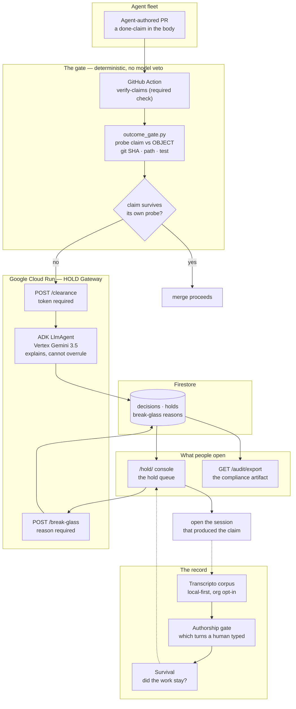

# Architecture

**Required submission artifact.** All Things Agentic · Fortified Enterprise Fleet.
Canonical product doc: [`hack.md`](../hack.md).

Two halves of one system. **The gate** decides whether an agent's work claim is true before
it merges. **The record** remembers what was claimed, whether it held, and whether the work
survived. The gate is how you install it. The record is why you keep it.

Solid lines are live today. Dashed lines are roadmap and are labelled as such on camera.



## Why this shape

**The model gets no veto.** Release authority is a deterministic object probe. The ADK agent
explains a decision and never overrules one, so a prompt-injected report cannot talk its way
through the gate. `outcome_gate.py` never executes text from a report.

**Composition blocks, judgement reports.** A claim that is false by composition is a
production-safety verdict and it blocks. Task-class and authorship judgements are recorded and
never gate. That boundary is deliberate.

**The join is the part nobody else can build.** A held claim opens to the session that
produced it. Zenity governs agent actions, Norm Ai does content compliance, Qodo reviews the
diff, Langfuse scores the trace. None of them holds the agent's transcript, so none of them
can answer "what actually happened before this claim was written."

## Mandatory stack (Devpost rules, verified 2026-08-22, re-probed 2026-08-27)

| Requirement | Implementation | Probe |
|---|---|---|
| Gemini 3.5+ via API or Vertex | `contract/gemini_impl.py` → Vertex | `python3 contract/eligibility.py` MET 1 |
| Google Agent Framework | `cloud/agent.py` `build_agent()` → ADK `LlmAgent` | MET 2 |
| Google Cloud infrastructure | Firestore default store · Cloud Run `fleet-wedge` | MET 3 · `.cloud_run_url` |

**Eligibility honesty:** 3 of 3 holds via the live URL or with GCP credentials present. A cold
local clone with no credentials reads **1 of 3** (ADK only), by design. Say that on camera.

**Smoke note:** use `GET /health` or `GET /`. GFE returns HTML 404 for `/healthz`. The video
must show the `*.run.app` URL.

## Live vs roadmap

**Live:** the required check · the object probe · `/clearance` with token · ADK + Vertex ·
Firestore · the hold queue · break-glass with a reason · `/audit/export` · enforce mode.

**Roadmap, dashed above, must not be claimed as built:** survival on the queue · GEAP Memory Bank (Firestore is the live path) · cross-harness ingestion beyond Claude
Code and Codex.

## What is NOT claimed

- Pub/Sub fan-out of N analysts.
- Population lift across an org from a single-builder corpus.
- Adjacency precision as "accurate." Measured base rate is **0.13%**, 6 of 4,785, two shapes unmeasured.
- Any install by a person who is not the author. That count is **zero**.

## Run

```bash
python3 contract/eligibility.py         # 3 of 3 with GCP, 1 of 3 cold
./tests/test_auth_gate.sh               # every mutating route rejects anon
curl -sS "$(cat .cloud_run_url)/health"
```
