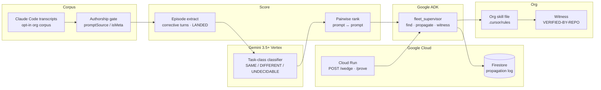

# Architecture — Transcripto fleet supervisor

**Required submission artifact.** Honest two-path: Firestore is live today; GEAP Memory Bank is optional stretch.



## Mandatory stack (Devpost rules, verified 2026-08-22)

| Requirement | Implementation | Probe |
|---|---|---|
| Gemini 3.5+ via API or Vertex | `contract/gemini_impl.py` → Vertex (`gemini-3.5-flash-lite`) | `python3 contract/eligibility.py` MET 1 |
| Google Agent Framework | `cloud/agent.py` `build_agent()` → ADK `LlmAgent` | MET 2 |
| Google Cloud infrastructure | Firestore default store · Cloud Run `fleet-wedge` | MET 3 · `.cloud_run_url` |

**Smoke note:** use `GET /health` or `GET /` — GFE returns HTML 404 for `/healthz` on this service. Video must show the `*.run.app` URL.

## What is NOT claimed

- Pub/Sub fan-out of N analysts (EYES: KILL for Week 0)
- Population lift across an org on a single-builder corpus (Track B)
- Classifier 8/8 while C1 is red

## Run

```bash
python3 contract/eligibility.py
python3 fleet_cli.py prove
./scripts/deploy_cloud_run.sh   # writes .cloud_run_url
```
