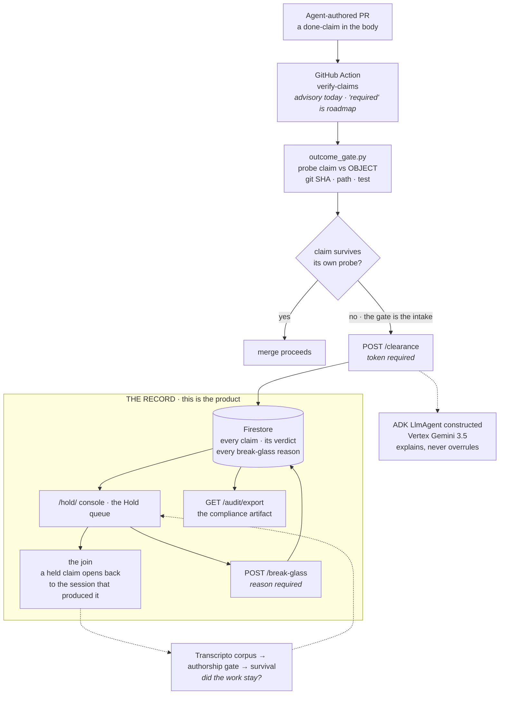

# Architecture

**Required submission artifact.** All Things Agentic · Fortified Enterprise Fleet.
Product: **THE AGENT WORK RECORD WITNESS**. Canonical doc: [`hack.md`](../hack.md).

The product is **the record**: who claimed what, whether the object agreed, whether the work
survived, and the session behind each claim. **The gate is a feature inside it** · the moment a
claim gets caught, and the reason a record accumulates at all. The gate is how you install it.
The record is why you keep it.

*"Hold" in this document is the name of the queue, not the product.*

The boxed region is the product. Everything above it is intake: **the gate exists to fill the
record**, and it is one branch of one edge. Solid lines are live today. Dashed lines are roadmap and are labelled as such on camera.



## Why this shape

**The record is the product, the gate is its intake.** A gate that greps a PR body for a SHA is a
weekend build. What compounds is what accumulates behind it: a queryable answer to *what did our
agent workforce actually do, and how much of it was true.*

**The model gets no veto.** Release authority is a deterministic object probe. The ADK agent
explains a decision and never overrules one, so a prompt-injected report cannot talk its way
through the gate. `outcome_gate.py` never executes text from a report.

**Composition blocks, judgement reports.** A claim that is false by composition is a
production-safety verdict and it blocks. Task-class and authorship judgements are recorded and
never gate. That boundary is deliberate.

**The join is the part nobody else can build.** A held claim opens to the session that
produced it. Zenity governs agent actions, Norm Ai does content compliance, Qodo reviews the
diff, Langfuse scores the trace. None of them holds the agent's transcript, so none of them
can answer "what actually happened before this claim was written."

## Mandatory stack (Devpost rules, verified 2026-08-22, re-probed 2026-08-27)

| Requirement | Implementation | Probe |
|---|---|---|
| Gemini 3.5+ via API or Vertex | `contract/gemini_impl.py` → Vertex | `python3 contract/eligibility.py` MET 1 |
| Google Agent Framework | `cloud/agent.py` `build_agent()` → ADK `LlmAgent` | MET 2 |
| Google Cloud infrastructure | Firestore default store · Cloud Run `fleet-wedge` | MET 3 · `.cloud_run_url` |

**Eligibility honesty, re-run 2026-08-27:** `contract/eligibility.py` prints **3 OF 3 MET** and
exits **0** with ADC on the `hack-fleet` project. The same script with no credentials prints
**1 OF 3 MET** (ADK only) and exits **1**. Both were run today; neither is quoted from a note.
Say the cold number on camera.

**Smoke note:** use `GET /health` or `GET /`. GFE returns HTML 404 for `/healthz`. The video
must show the `*.run.app` URL.

## Live vs roadmap

**Live:** the object probe · `/clearance` with token · `/break-glass` with a reason · Firestore ·
the Hold queue · `/audit/export` · enforce mode · the join from a held claim to its session.

**Roadmap · dashed above, must not be claimed as built:** the check as a *required* check ·
Gemini invoked inside the container (the ADK agent is constructed and visible in `/health`, and
is not called on the request path today) · survival on the queue · GEAP Memory Bank · cross-harness
ingestion beyond Claude Code and Codex.

## What is NOT claimed

- Pub/Sub fan-out of N analysts.
- Population lift across an org from a single-builder corpus.
- Adjacency precision as "accurate." Measured base rate is **0.13%**, 6 of 4,785, two shapes unmeasured.
- Any install by a person who is not the author. That count is **zero**.
- Any real agent claim in the record. Measured 2026-08-27: **4 clearances, all four staged by us,
  `clear: 0`.** Nothing has ever passed the gate, because nothing real has ever gone through it.

## Run

```bash
python3 contract/eligibility.py         # 3 of 3 with GCP, 1 of 3 cold (exit 1)
./tests/test_auth_gate.sh               # every mutating route rejects anon · LOCALLY
curl -sS "$(cat .cloud_run_url)/health"
```

> **Read the second line honestly.** `test_auth_gate.sh` is green against a local server. Probed
> against the deployed service on 2026-08-27, anonymous `POST /prove` returned **201**, not 401.
> The gate is correct in `cloud/service.py`; the running revision is behind it on that one route.
> A green local test is not a statement about production.
