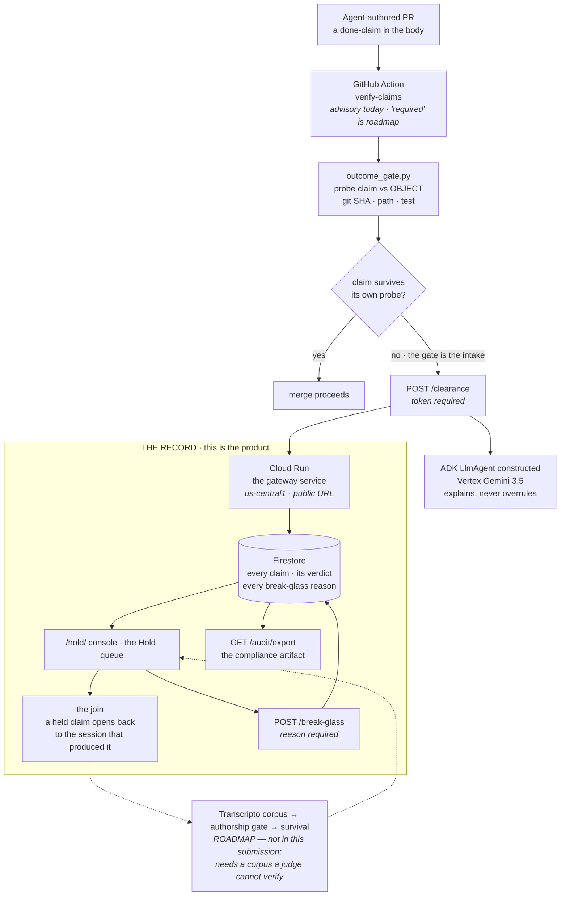

# Architecture

**Required submission artifact.** All Things Agentic · Fortified Enterprise Fleet.
Product: **THE AGENT WORK RECORD WITNESS**. Canonical doc: [`hack.md`](../hack.md).

> **Run your agents. Check the math.**

The product is **the record**: who claimed what, whether the object agreed, whether the work
survived, and the session behind each claim. **The gate is a feature inside it** · the moment a
claim gets caught, and the reason a record accumulates at all. The gate is how you install it.
The record is why you keep it.

*"Hold" in this document is the name of the queue, not the product.*

The boxed region is the product. Everything above it is intake: **the gate exists to fill the
record**, and it is one branch of one edge. Solid lines are live today. Dashed lines are roadmap and are labelled as such on camera.



## Why this shape

**The record is the product, the gate is its intake.** A gate that greps a PR body for a SHA is a
weekend build. What compounds is what accumulates behind it: a queryable answer to *what did our
agent workforce actually do, and how much of it was true.*

**The model gets no veto.** Release authority is a deterministic object probe. The ADK agent
explains a decision and never overrules one, so a prompt-injected report cannot talk its way
through the gate. `outcome_gate.py` never executes text from a report.

**Composition blocks, judgement reports.** A claim that is false by composition is a
production-safety verdict and it blocks. Task-class and authorship judgements are recorded and
never gate. That boundary is deliberate.

**The join is the part nobody else can build.** A held claim opens to the session that
produced it. Zenity governs agent actions, Norm Ai does content compliance, Qodo reviews the
diff, Langfuse scores the trace. None of them holds the agent's transcript, so none of them
can answer "what actually happened before this claim was written."

## Mandatory stack (Devpost rules, verified 2026-08-22, re-probed 2026-08-27)

| Requirement | Implementation | Probe |
|---|---|---|
| Gemini 3.5+ via API or Vertex | `contract/gemini_impl.py` → Vertex | `python3 contract/eligibility.py` MET 1 |
| Google Agent Framework | `cloud/agent.py` `build_agent()` → ADK `LlmAgent` | MET 2 |
| Google Cloud infrastructure | Firestore default store · Cloud Run `fleet-wedge` | MET 3 · `.cloud_run_url` |

**Eligibility honesty, re-run 2026-08-27:** `contract/eligibility.py` prints **3 OF 3 MET** and
exits **0** with ADC on the `hack-fleet` project. The same script with no credentials prints
**1 OF 3 MET** (ADK only) and exits **1**. Both were run today; neither is quoted from a note.
Say the cold number on camera.

**Smoke note:** use `GET /health` or `GET /`. GFE returns HTML 404 for `/healthz`. The video
must show the `*.run.app` URL.

## The two claims that stopped being name-checks tonight

Both were true-looking and false, and both were fixed at the object rather than reworded.

**Gemini was never called inside the container.** The task-class classifier fell back to a
substring heuristic whenever no key file was present, which is always, because the key lives
outside the repo and the Dockerfile mounts no secret. Graded against this repo's own control
set, that fallback was **row-for-row identical to `classify_always_same`**, which
`contract/task_class.py:81` declares to be **the negative control**: a stub carrying zero
information. It scored **4 of 8** and therefore appeared to beat the frozen **3 of 8** baseline,
**purely by defaulting**. The benchmark was being won by a stub the repo had already labelled
meaningless.

Real Vertex now scores **6 of 8**, passes both false-positive traps, and every failure mode
collapses to `UNMEASURED` rather than a verdict. `UNMEASURED` is never cached, because an
unreachable model is a condition of the environment, not a fact about two prompts.

**The ADK agent was constructed and never invoked**, with `type()` printed on `/health` as
evidence. It now runs through `google.adk.runners.Runner`: `POST /agent/run` returns **7 events
and 3 real tool calls**, and `/health` carries the run receipt instead of a class name. A
clearance record stores `agent_class` alongside `agent_invoked`, so no reader can mistake an
import for a model having reasoned about that clearance. Since 2026-08-29 the agent is called on
the clearance path itself: record `H-a6151a95ac`, written by a real GitHub Action, carries
`agent_invoked: true` and `agent_explanation.invoked: true`.

**Verified red as well as green.** With credentials removed, `/agent/run` returns 502,
`invoked: false`, and no tool calls. A receipt that cannot fail is not a receipt.

**Two posture facts about that token gate, stated rather than waited for.** `HOLD_API_TOKEN` is a
**plaintext environment variable** on the Cloud Run service — `secretmanager.googleapis.com` is
enabled on `hack-fleet` and unused, so anyone with `run.services.get` can read it. And the service
runs as the **default compute service account**
`568004190078-compute@developer.gserviceaccount.com`, which holds `roles/editor`: the principal
behind the record can delete the collection. Neither is a design position; both are open items.

**And the record is a keyed store, not an append-only log.** `FirestoreStore.put` does
`document(id).set(record)` (`cloud/store.py`), so closing a hold via `/break-glass` rewrites that
clearance document in place to `open: false` rather than superseding it. The exception is appended
with its own `E-` id and the API never deletes, but the prior version of a closed clearance is not
recoverable from the record. Named here rather than found by a reader.

## The seven enterprise surfaces, measured before tonight

Fortified Enterprise Fleet names seven. Measured at the object: **0 present, 3 partial, 4 absent.**

| Surface | State | Note |
|---|---|---|
| Agent Gateway | partial | strongest surface: enforce vs report-only genuinely changes behaviour |
| Agent Observability | partial | `/audit` and `/audit/export` real and Firestore-backed; no OpenTelemetry |
| Agent Identity | partial | real token gate and break-glass role; one shared token is not per-agent identity |
| Agent Runtime | absent, now partial | the ADK Runner landed tonight |
| Memory Bank | absent | the session is carried as provenance; nothing is retrieved and fed back |
| Agent Registry | absent | `/prove` publishes a prompt, not an agent. It would be a **skill** registry and we would say skill. |
| Model Armor | absent | an honest adjacent design exists, transcript text is never executed, but that is a trust boundary and not a content filter. **Never call it Model Armor.** |

## Live vs roadmap

**Live:** the object probe · `/clearance` with token · `/break-glass` with a reason · Firestore ·
the Hold queue · `/audit/export` · enforce mode · the join from a held claim to its session ·
**Gemini invoked inside the container on the clearance path** through the ADK `Runner` — record
`H-a6151a95ac` carries `agent_explanation.invoked: true`, `model: gemini-3.5-flash-lite`,
`framework: google.adk.runners.Runner`. `/health` still reports `invoked: false` because that
receipt is per-process and the health check answers from a different instance.

**Roadmap · dashed above, must not be claimed as built:** the check as a *required* check ·
survival on the queue · GEAP Memory Bank · cross-harness ingestion beyond Claude Code and Codex.

## What is NOT claimed

- Pub/Sub fan-out of N analysts.
- Population lift across an org from a single-builder corpus.
- Adjacency precision as "accurate." Measured base rate is **0.13%**, 6 of 4,785, two shapes unmeasured.
- Any install by a person who is not the author. That count is **zero**.
- Any real agent claim in the record. Measured 2026-08-27: **4 clearances, all four staged by us,
  `clear: 0`.** Nothing has ever passed the gate, because nothing real has ever gone through it.

## Run

```bash
python3 contract/eligibility.py         # 3 of 3 with GCP, 1 of 3 cold (exit 1)
./tests/test_auth_gate.sh               # every mutating route rejects anon · LOCALLY
curl -sS "$(cat .cloud_run_url)/health"
```

> **Read the second line honestly.** `test_auth_gate.sh` is green against a local server, and a
> green local test is never a statement about production — so production gets probed separately.
> On 2026-08-27 anonymous `POST /prove` returned **201** there, and the deployed revision was
> behind `cloud/service.py` on that one route. **Re-probed 2026-08-28: it returns 401
> `HOLD_API_TOKEN required`. Closed.** The rule stands even though this instance of it is fixed:
> probe the deployment, not the test.
